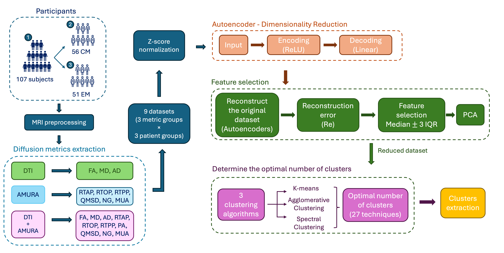

# Migraine dMRI Clustering

Code for the article:

> Gallo A, Tristán-Vega A, Guerrero ÁL, García-Azorín D, Aja-Fernández S, de Luis-García R, Planchuelo-Gómez Á.
> **Unsupervised Learning on Advanced Diffusion MRI Metrics for Clinical Characterization of Migraine.**

## Pipeline

1. Z-score normalization of the diffusion metrics.
2. Dimensionality reduction with an autoencoder.
3. Feature selection based on the autoencoder reconstruction error.
4. PCA on the selected features.
5. Estimation of the optimal number of clusters with NbClust (R).
6. Clustering with K-Means, Agglomerative and Spectral clustering.

The same code is applied to each diffusion model (DTI, AMURA, DTI+AMURA) and each group (all patients, CM, EM), changing only the input feature matrix.

## Repository structure

| Path | Description |
|------|-------------|
| `migraine_clustering_pipeline.ipynb` | Main pipeline: normalization, autoencoder, feature selection, PCA and clustering |
| `nbclust_optimal_k.R` | Estimation of the optimal number of clusters (NbClust) on the PCA features saved by the pipeline |
| `longitudinal_association.ipynb` | Exploratory longitudinal analysis in the CM group: logistic regression with LOOCV (AUC) and likelihood ratio test |

## Data

Patient data are **not included** in this repository due to privacy restrictions. To run the code, provide the following files and set their paths in `FEATURES_PATH` and `CLINICAL_PATH` (last cell of `migraine_clustering_pipeline.ipynb`):

**Features file** (`,`-separated): one row per subject, an index column `ID`, and one column per diffusion metric and white matter region (48 regions, JHU ICBM-DTI-81 atlas). One file per diffusion model and group.

| Column | Description |
|--------|-------------|
| `ID` | Subject identifier (`CM1`…`CM56`, `EM1`…`EM54`, matching the feature files) |
| `CM` | 1 = chronic migraine, 0 = episodic migraine |
| `Woman` | 1 = woman, 0 = man |
| `Age` | Age (years) |
| `MOH` | Medication overuse headache (1 = presence, 0 = absence) |
| `Aura` | Presence of aura (1/0) |
| `freq_mig` | Monthly migraine frequency (days/month) |
| `time_mig` | Years since migraine onset |
| `time_cro` | Time since onset of chronic migraine (CM only) |
| `topiramate_binary` | Response to topiramate (1 = positive, 0 = no response; CM only, empty if not available) |
| `CM_long` | Diagnosis of CM at least 3 years after MRI (CM only, empty if not available) |

## How to run

1. **Run the main pipeline.** In the last cell of `migraine_clustering_pipeline.ipynb`, set `GROUP` (`"AllPatients"`, `"CM"` or `"EM"`), `MODEL` (`"DTI"`, `"AMURA"` or `"DTI+AMURA"`), `FEATURES_PATH` and `CLINICAL_PATH`, then run the notebook. It saves the PCA features to `results/pca_<GROUP>_<MODEL>.csv`.
2. **Estimate the optimal number of clusters.** Set `model` in `nbclust_optimal_k.R` and run it. It reads the PCA features of the three groups.
3. **Run the clustering.** Set `K_BEST` in the main notebook to the selected value and run it again. It prints the silhouette score for each clustering method.

## Requirements

- Python 3.9: tensorflow/keras 2.15, scikit-learn, numpy, pandas, scipy, jupyter
- R 4.1.2: NbClust
